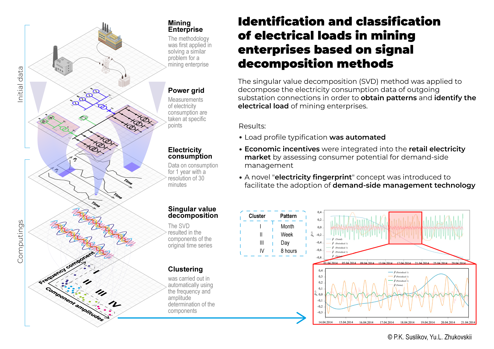

[English](README.md) | [Русский](README.ru.md)

# PowerMeter

Open-source Modbus TCP energy monitoring platform with real-time dashboards, demand-response potential assessment, and SSA-based electrical load pattern analysis.

PowerMeter collects measurements from Modbus TCP power meters, stores them locally in SQLite, builds aggregated time series, calculates the Demand Response Potential Index (DRPI), and provides FastAPI dashboards for operational monitoring and research analysis.

## Why PowerMeter

Industrial energy systems often need a practical bridge between field devices, local data storage, operational dashboards, and research-grade analytics. PowerMeter is designed for that bridge:

- **Industrial energy monitoring:** collect active power, voltage, current, frequency, and related metrics from power meters.
- **Modbus TCP integration:** configure meters and registers in YAML, including holding/input registers and multiple numeric data formats.
- **Local-first architecture:** keep measurements and analytics in a local SQLite database, suitable for labs, pilot deployments, and Raspberry Pi installations.
- **Demand response analytics:** estimate load flexibility using a rolling DRPI calculation over aggregated active-power profiles.
- **Research applications:** analyze load patterns with Singular Spectrum Analysis (SSA), component reconstruction, W-correlation, and KMeans clustering in amplitude-frequency space.

## Features

- Asynchronous Modbus TCP collection from YAML-defined devices.
- Support for `holding` and `input` registers.
- Register decoding for `float32`, `float32_swapped`, `uint16`, `int16`, `uint32`, and `int32`.
- Configurable Modbus address handling with `minus_400000`, `minus_400001`, and `raw` modes.
- Batch writing of raw measurements into SQLite.
- Aggregation windows of 5, 10, 15, 30, and 60 minutes.
- Automatic raw-data retention policy, with the default set to the last 24 hours.
- DRPI calculation for each meter and for aggregate `TOTAL` consumption.
- SSA decomposition of active-power time series with component reconstruction and KMeans clustering.
- FastAPI web application with Jinja2 templates and JavaScript charts.
- Swagger/OpenAPI documentation at `/docs`.
- Raspberry Pi deployment guide for edge installations.

## Architecture


Runtime services:

- `services/collector.py` polls configured Modbus TCP devices and puts normalized records into an `asyncio.Queue`.
- `services/writer.py` validates, buffers, and writes raw records to SQLite in batches.
- `services/aggregator.py` creates completed aggregation windows and stores mean values in aggregation tables.
- `services/drpi_service.py` reads 5-minute active-power aggregates and writes rolling DRPI results.
- `web/app.py` exposes dashboard pages and JSON API endpoints through FastAPI.

The full production pipeline is started by [main.py](main.py). It runs collector, writer, aggregator, and DRPI service in one asyncio application and performs graceful shutdown on supported platforms.

For a deeper component description, see [docs/ARCHITECTURE.md](docs/ARCHITECTURE.md).

## Project Structure

```text
.
├── config/                 # YAML configuration for devices and services
├── core/                   # DRPI and SSA computational modules
├── data/                   # Local SQLite database location
├── docs/                   # Documentation for users, researchers, and contributors
├── services/               # Collector, writer, aggregator, and DRPI service
├── web/                    # FastAPI application, templates, API routes, and static assets
├── main.py                 # Full pipeline entry point
├── requirements.txt        # Python dependencies
└── README.md               # English project entry point
```

## Requirements

- Python 3.11 or newer.
- Access to Modbus TCP meters or a Modbus TCP gateway.
- SQLite, through Python's standard `sqlite3` module.
- macOS, Linux, or Windows for local development. Signal handlers in `main.py` depend on platform support.

## Quick Start

Create a virtual environment and install dependencies:

```bash
python -m venv .venv
source .venv/bin/activate
pip install -r requirements.txt
```

For Windows PowerShell:

```powershell
python -m venv .venv
.\.venv\Scripts\Activate.ps1
pip install -r requirements.txt
```

Create a local device configuration:

```bash
cp config/devices.example.yaml config/devices.yaml
```

Edit `config/devices.yaml` with real meter IP addresses, ports, `unit_id` values, address mode, and registers.

Minimal device example:

```yaml
devices:
  - name: PowerMeter_1
    host: 192.168.1.100
    port: 502
    unit_id: 1
    address_mode: minus_400000
    enabled: true
    timeout: 1.5
    registers:
      - name: active_power_avg
        address: 403059
        data_type: float32
        scale: 1.0
        function: holding
        enabled: true
```

Supported address modes:

- `minus_400000`: converts `403059` to `3059`.
- `minus_400001`: converts `403059` to `3058`.
- `raw`: passes the address to `pymodbus` without conversion.

Verify Modbus register mapping before running the production pipeline:

```bash
python -m services.debug_collector
```

The diagnostic collector does not write to the database. It helps verify offset handling, function code, register count, and word order for `float32` values.

Start the full data pipeline:

```bash
python main.py
```

Start the web interface in a separate process:

```bash
uvicorn web.app:app --host 0.0.0.0 --port 8000
```

Open:

- `http://localhost:8000/overview`
- `http://localhost:8000/history`
- `http://localhost:8000/drpi`
- `http://localhost:8000/ssa`
- `http://localhost:8000/docs`

## Configuration

Default runtime data is stored in `data/energy.db`.

- `config/devices.example.yaml` defines example Modbus TCP devices and registers.
- `config/writer.yaml` controls SQLite path, batch size, flush interval, retry behavior, PRAGMA settings, and the `raw_data` table name.
- `config/aggregator.yaml` controls aggregation intervals, metric selection, polling interval, and raw-data retention.
- `config/drpi.yaml` controls the DRPI source table, source mode, rolling window, baseline quantile, flexibility target, and component weights.
- `config/ssa.yaml` documents default SSA parameters for the analysis layer, including history length, window length, sampling frequency, component limits, and KMeans settings.

## Demo Mode

PowerMeter does not currently include an implemented demo workflow. A future demo mode should make the project evaluable without physical meters by combining simulated Modbus devices, synthetic load profiles, a pre-populated SQLite database, and example screenshots.

See [docs/DEMO_MODE.md](docs/DEMO_MODE.md) for the proposed demo-mode architecture and implementation roadmap.

## Raspberry Pi Deployment

PowerMeter is intended to run locally at the edge, including on Raspberry Pi hardware. The deployment guide covers project synchronization without runtime data, Wi-Fi and SSH setup, Python installation, virtual environment creation, pipeline execution through `systemd`, and manual FastAPI startup.

See [docs/RASPBERRY_PI.md](docs/RASPBERRY_PI.md).

## Database Tables

- `raw_data`: raw measurements with `timestamp`, `device_id`, `metric`, `value`, and `created_at`.
- `agg_5min`, `agg_10min`, `agg_15min`, `agg_30min`, `agg_1h`: aggregated mean values per window, device, and metric.
- `drpi_results`: calculated `F1`, `F2`, `F3`, `R_raw`, and `DRPI` values by source.

## API

Dashboard pages:

- `GET /overview`
- `GET /history`
- `GET /drpi`
- `GET /ssa`

JSON endpoints:

- `GET /api/history/realtime`
- `GET /api/history/series`
- `GET /api/overview/summary`
- `GET /api/overview/power-meters`
- `GET /api/overview/drpi-heatmap`
- `GET /api/drpi/summary`
- `GET /api/drpi/history`
- `GET /api/drpi/components`
- `GET /api/ssa/analyze`

Generated OpenAPI documentation is available through Swagger UI at `/docs`.

Examples and parameter details are documented in [docs/API.md](docs/API.md).

## Demand Response Potential Index (DRPI)

DRPI is calculated over a rolling active-power window and estimates the potential for a load or group of loads to participate in demand response. The default production configuration uses 5-minute active-power aggregates and a window of `288` points, equal to 24 hours.

The current implementation calculates:

- `F1`: flexible load share relative to total consumption.
- `F2`: temporal concentration of flexible load.
- `F3`: normalized power-change dynamics.
- `DRPI`: weighted sum of `F1`, `F2`, and `F3`.

Default weights are configured in `config/drpi.yaml` as `w1 = 0.5`, `w2 = 0.3`, and `w3 = 0.2`. The weights are normalized by the engine before use.

Method details, equations, assumptions, and interpretation guidance are available in [docs/DRPI_METHOD.md](docs/DRPI_METHOD.md).

## Singular Spectrum Analysis (SSA)

SSA is used to decompose aggregated active-power time series into reconstructed components. The web page at `/ssa` lets users select meters, time range, aggregation level, SSA window size, component count, and cluster count.

The analysis workflow includes:

- trajectory matrix construction;
- singular value decomposition;
- elementary component reconstruction;
- component contribution and W-correlation calculation;
- component clustering by dominant frequency and amplitude.

Method details and practical usage guidance are available in [docs/SSA_METHOD.md](docs/SSA_METHOD.md).



## Scientific Background

PowerMeter builds on research in demand response, electrical load decomposition, and non-intrusive load monitoring (NILM). In the codebase, the term `DRPI` means Demand Response Potential Index. In earlier IEEE-related work, a related index was described as the Demand Response Flexibility Index; this repository consistently uses `DRPI`.

References:

- Zhukovskiy Y.L., Suslikov P.K. [Identification and classification of electrical loads in mining enterprises based on signal decomposition methods](https://pmi.spmi.ru/pmi/article/view/16670?setLocale=en_US). Journal of Mining Institute, 2025, Vol. 275, pp. 5-17. EDN: HPZAGK.
- Suslikov P. A Cluster-Informed Demand Response Flexibility Index for Reconstructed Load Patterns. IEEE EDM 2026. DOI and IEEE Xplore page expected after publication of the conference proceedings.
- Zhukovskiy Y., Suslikov P., Rasputin D. [NILM-Based Feedback for Demand Response: A Reproducible Binary State-Detection Algorithm Using Active Power](https://www.mdpi.com/2673-4826/7/1/23). Electricity, 2026, 7(1), 23. DOI: [10.3390/electricity7010023](https://doi.org/10.3390/electricity7010023).

Future research directions include NILM-based feedback for demand response, hysteresis-based ON/OFF state labeling, compact active-power feature extraction, collinearity-aware feature selection, probabilistic binary classifiers for load groups, threshold optimization through `Fβ`, probability post-processing, event-based metrics, and integration of NILM outputs as feedback for demand-response decision support.

## Roadmap

See [docs/ROADMAP.md](docs/ROADMAP.md) for short-term, medium-term, and long-term development plans.

## Citation

If you use PowerMeter in research, publications, demonstrations, or derived software, please cite it as research software. A machine-readable citation file is provided in [CITATION.cff](CITATION.cff).

Citation examples and future DOI guidance are available in [docs/CITATION.md](docs/CITATION.md).

## GitHub Discoverability

Recommended repository topics:

`modbus-tcp`, `energy-monitoring`, `smart-meter`, `industrial-iot`, `demand-response`, `energy-flexibility`, `load-profiling`, `singular-spectrum-analysis`, `ssa`, `nilm`, `fastapi`, `sqlite`, `raspberry-pi`, `energy-analytics`

See [docs/GITHUB_VISIBILITY.md](docs/GITHUB_VISIBILITY.md) for recommended GitHub settings, topics, release strategy, and visibility improvements.

## Contributing

Contributions are welcome, especially in documentation, tests, deployment examples, simulated/demo data, API ergonomics, and research validation. Please read [docs/CONTRIBUTING.md](docs/CONTRIBUTING.md) before opening issues or pull requests.

## License

PowerMeter is distributed under the MIT License. See [LICENSE](LICENSE).
