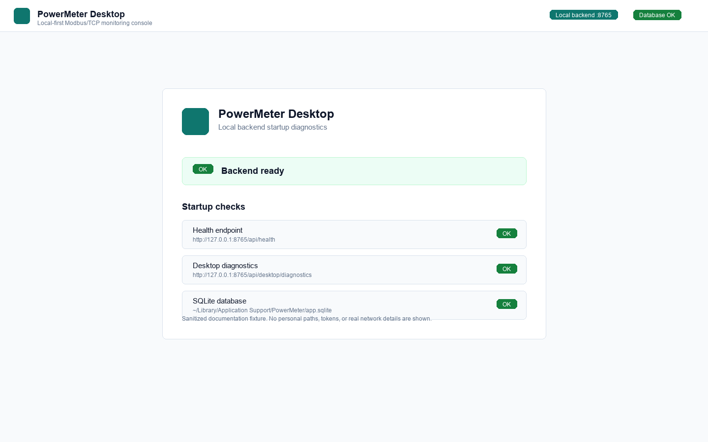
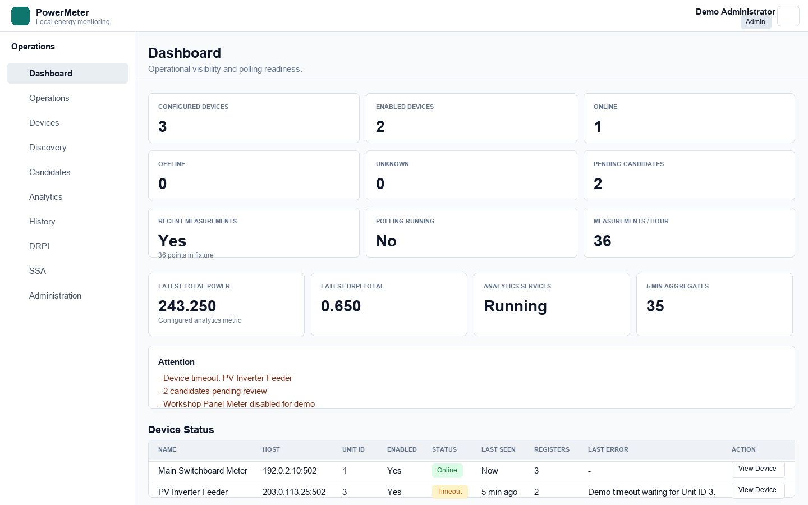
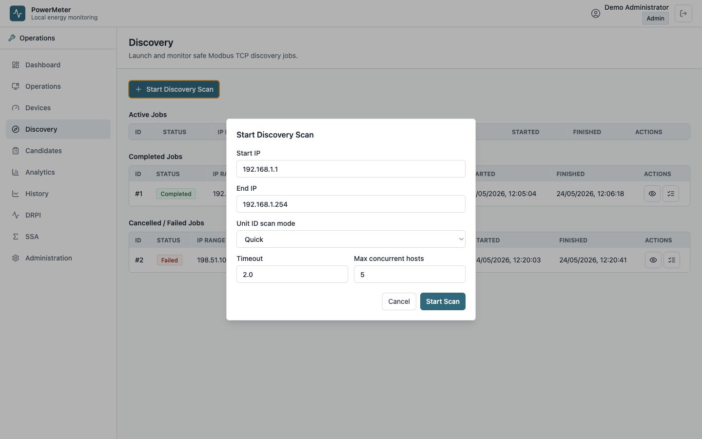
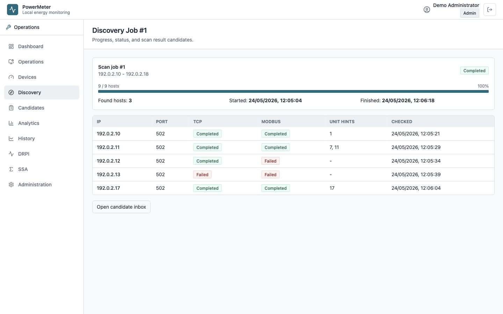
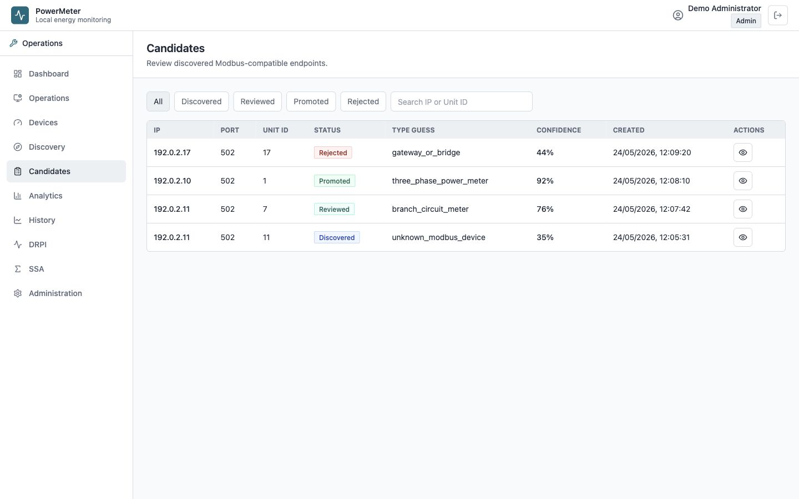
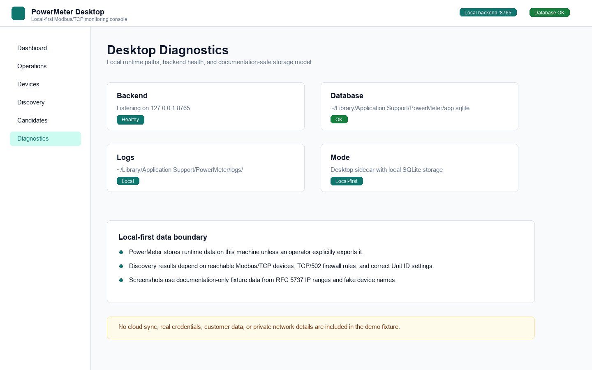

# PowerMeter

[English](README.md) | [Русский](README.ru.md)

**PowerMeter is a local-first desktop application for discovering, onboarding, and monitoring Modbus/TCP power meters with a bundled FastAPI backend and local SQLite storage.**


PowerMeter v0.2.0-app is an early macOS desktop release. It is useful for lab validation, local pilot deployments, Modbus/TCP discovery workflows, and energy analytics experiments. It is not a cloud SaaS product, a full SCADA platform, or a production-hardened installer.

## Screenshots

| Startup diagnostics | Dashboard | Discovery setup |
| --- | --- | --- |
|  |  |  |

| Scan results | Candidate review | Desktop diagnostics |
| --- | --- | --- |
|  |  |  |

Screenshots use documentation-only fixture data from [docs/demo](docs/demo/README.md). They do not include real credentials, customer data, private IP ranges, tokens, or local machine paths.

## What PowerMeter Does

PowerMeter helps operators and developers work through a local Modbus/TCP meter lifecycle:

```text
Modbus/TCP discovery
  -> scan results
  -> discovered candidates
  -> candidate probing
  -> device promotion
  -> managed devices
  -> polling
  -> measurements
  -> aggregation
  -> dashboard, trends, DRPI, SSA
```

The app discovers reachable TCP/502 endpoints, probes possible Unit IDs, records candidate devices for review, promotes confirmed devices into a managed inventory, polls configured registers, stores measurements locally, and displays operational and analytics views.

## Key Features

- Local macOS desktop app built with Tauri v2.
- Bundled FastAPI backend sidecar supervised by the desktop shell.
- React/Vite frontend served locally.
- SQLite runtime database stored under the OS application data directory.
- Modbus/TCP discovery with quick, extended, full, and custom Unit ID scan modes.
- Scan job history with successful and failed discovery results.
- Candidate inbox for discovered Modbus-compatible endpoints.
- Candidate probing, fingerprinting, rejection, and promotion workflows.
- Managed device inventory with register configuration and polling readiness.
- Polling engine, raw measurements, aggregation tables, and operational dashboard.
- Historical trends plus DRPI demand-response analytics and SSA decomposition views.
- Desktop startup health checks and diagnostics endpoints.

## Desktop App Architecture

PowerMeter v0.2.0-app packages three local pieces:

- **Desktop shell:** Tauri v2 macOS app bundle.
- **Backend sidecar:** FastAPI/Uvicorn backend packaged with PyInstaller and started by the desktop shell.
- **Frontend:** React/Vite application loaded by the desktop shell and pointed at the local backend.

In desktop mode, the backend binds to:

```text
127.0.0.1:8765
```

The desktop startup screen checks backend health, fetches diagnostics, and then enters the authenticated application UI.

## Local-First Data And Privacy

PowerMeter is designed to run locally. The desktop app stores runtime data on the machine where it is launched:

```text
~/Library/Application Support/PowerMeter/
```

Important local files include:

```text
~/Library/Application Support/PowerMeter/app.sqlite
~/Library/Application Support/PowerMeter/logs/backend.log
~/Library/Application Support/PowerMeter/logs/desktop.log
```

The current app does not include cloud sync, hosted accounts, or a multi-site cloud service. Operators should still treat the local database and logs as sensitive because they can contain device names, register data, measurement history, and local operational details.

Modbus/TCP discovery depends on the real network environment: target devices must be reachable, firewall rules must allow TCP/502, and Unit ID settings must match the device or gateway configuration.

## Install And Run From Release

For the v0.2.0-app macOS beta, open `PowerMeter.app`. On first run, macOS may warn because the app is unsigned and not notarized.

The first local database creates a default administrator:

```text
admin / admin
```

Change the default password before using the app for operational data. See [docs/MACOS_INSTALL_AND_RUN.md](docs/MACOS_INSTALL_AND_RUN.md) for the current install and first-run notes.

## Development Setup

Install Python and Node dependencies, then run the backend and frontend separately.

Backend:

```bash
python3 -m uvicorn backend.app.main:app --reload
```

Frontend:

```bash
cd frontend
npm install
npm run dev
```

Browser development defaults to `http://127.0.0.1:8000/api` unless `VITE_API_BASE_URL` is set. Desktop mode uses `http://127.0.0.1:8765/api`.

## Demo Data For Screenshots

Generate the documentation-only demo database with:

```bash
python3 scripts/seed_demo_data.py
```

Default output:

```text
docs/demo/powermeter_demo.sqlite
```

The fixture uses fake meter names, fixed timestamps, documentation-safe IP ranges, successful and failed scan results, multiple Unit IDs, managed devices, probe results, measurement rows, and analytics summary data. It is not loaded by the desktop runtime unless you explicitly set `POWERMETER_DB_PATH` to the generated file.

## Building The macOS App

From the repository root:

```bash
scripts/build_macos_app.sh
```

Expected output:

```text
src-tauri/target/release/bundle/macos/PowerMeter.app
```

The build pipeline compiles the frontend, packages the backend sidecar, builds the Tauri app, and copies the backend runtime into the app bundle. See [docs/DEVELOPER_GUIDE.md](docs/DEVELOPER_GUIDE.md) for validation commands.

## Diagnostics And Troubleshooting

Useful local checks:

```text
http://127.0.0.1:8765/api/health
http://127.0.0.1:8765/api/desktop/diagnostics
```

Reset local desktop app data with:

```bash
scripts/reset_desktop_app_data.sh
```

The reset script requires explicit confirmation before deleting the application data directory. For common startup, backend, database, and Gatekeeper issues, see [docs/DESKTOP_TROUBLESHOOTING.md](docs/DESKTOP_TROUBLESHOOTING.md).

## Documentation

- [App Architecture](docs/APP_ARCHITECTURE.md)
- [User Guide](docs/USER_GUIDE.md)
- [Developer Guide](docs/DEVELOPER_GUIDE.md)
- [macOS Install and Run](docs/MACOS_INSTALL_AND_RUN.md)
- [Desktop Troubleshooting](docs/DESKTOP_TROUBLESHOOTING.md)
- [Modbus Discovery and Onboarding](docs/MODBUS_DISCOVERY_AND_ONBOARDING.md)
- [DRPI and SSA Analytics](docs/ANALYTICS_DRPI_SSA.md)
- [Security Notes](docs/SECURITY_NOTES.md)
- [Release Checklist](docs/RELEASE_CHECKLIST.md)

Historical stage notes are archived in [docs/archive/stages](docs/archive/stages).

## Roadmap

- Improve signed and notarized macOS distribution.
- Add a more polished installer and update flow.
- Expand register-map templates for common meter families.
- Broaden automated end-to-end coverage for desktop startup and discovery workflows.
- Improve import/export flows for local data handoff.
- Evaluate Windows and Linux packaging after the macOS desktop beta stabilizes.

## Known Limitations

- The v0.2.0-app macOS bundle is unsigned and not notarized.
- This is an early desktop/application release, not a hardened production distribution.
- Modbus discovery only works when devices are reachable and configured for the scanned Unit IDs.
- Register maps may need manual configuration for specific meter models.
- PowerMeter does not issue control commands and is not a SCADA/control platform.
- There is no cloud sync, hosted account service, or multi-site cloud account model.
- Windows and Linux desktop packaging are not implemented yet.
- Automated end-to-end test coverage is still limited.

## License

See [LICENSE](LICENSE).
