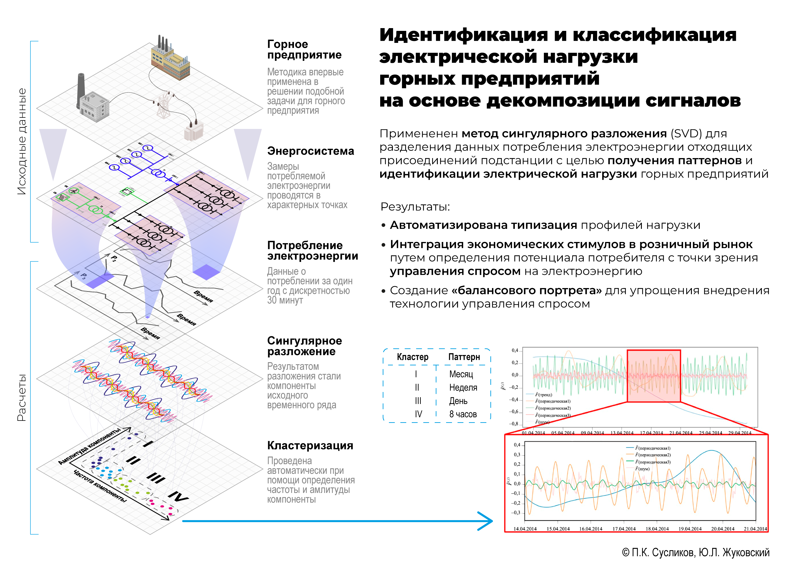

[English](README.md) | [Русский](README.ru.md)

# PowerMeter Energy Dashboard

Система онлайн-мониторинга электропотребления для Modbus TCP счётчиков. Проект собирает измерения с устройств, сохраняет их в SQLite, строит агрегированные временные ряды и рассчитывает аналитические показатели DRPI и SSA. Поверх пайплайна есть FastAPI-веб-интерфейс с дашбордами текущего состояния, истории, DRPI и SSA-анализа.

## Возможности

- опрос Modbus TCP-устройств по YAML-конфигурации;
- поддержка holding/input регистров и типов `float32`, `float32_swapped`, `uint16`, `int16`, `uint32`, `int32`;
- запись сырых измерений в SQLite батчами;
- агрегация рядов по окнам 5, 10, 15, 30 и 60 минут;
- автоматическое хранение raw-данных за последние сутки;
- расчёт DRPI (Индекса потенциала внедрения технологии управления спросом) по каждому счётчику и по суммарному потреблению `TOTAL`;
- SSA-декомпозиция временных рядов с кластеризацией компонент через KMeans в амплитудо-частотном пространстве;
- веб-интерфейс на FastAPI, Jinja2 и JavaScript-графиках;
- Swagger/OpenAPI-документация API на `/docs`.

## Архитектура

```text
Modbus meters
    |
    v
services/collector.py  ->  asyncio.Queue  ->  services/writer.py  ->  raw_data
                                                              |
                                                              v
                                                   services/aggregator.py
                                                              |
                         +------------------------------------+------------------+
                         v                                                       v
               agg_5min / agg_10min / agg_15min / agg_30min / agg_1h       raw retention
                         |
                         v
               services/drpi_service.py  ->  drpi_results
                         |
                         v
                 web/app.py dashboards and API
```

Основной запуск пайплайна находится в [`main.py`](main.py). Он поднимает collector, writer, aggregator и DRPI service в одном asyncio-приложении и корректно завершает их по сигналу остановки.

## Структура проекта

```text
.
├── config/                 # YAML-конфигурация устройств и сервисов
├── core/                   # DRPI и SSA вычислительные модули
├── data/                   # локальная SQLite БД
├── services/               # collector, writer, aggregator, drpi service
├── web/                    # FastAPI-приложение, шаблоны, API и статика
├── main.py                 # запуск полного production-пайплайна
├── requirements.txt        # Python-зависимости
└── README.md
```

## Требования

- Python 3.11 или новее;
- доступ к Modbus TCP-счётчикам или шлюзу;
- SQLite, используется стандартный модуль Python;
- macOS/Linux/Windows для локального запуска, но сигнал-обработчики в `main.py` зависят от возможностей платформы.

## Установка

```bash
python -m venv .venv
source .venv/bin/activate
pip install -r requirements.txt
```

Для Windows PowerShell:

```powershell
python -m venv .venv
.\.venv\Scripts\Activate.ps1
pip install -r requirements.txt
```

## Конфигурация устройств

Создайте локальный файл устройств из примера:

```bash
cp config/devices.example.yaml config/devices.yaml
```

Затем отредактируйте `config/devices.yaml`: укажите IP-адреса, порт, `unit_id`, режим адресации и список регистров.

Минимальный пример устройства:

```yaml
devices:
  - name: PowerMeter_1
    host: 192.168.1.100
    port: 502
    unit_id: 1
    address_mode: minus_400000
    enabled: true
    timeout: 1.5
    registers:
      - name: active_power_avg
        address: 403059
        data_type: float32
        scale: 1.0
        function: holding
        enabled: true
```

Поддерживаемые режимы адресации:

- `minus_400000`: `403059 -> 3059`;
- `minus_400001`: `403059 -> 3058`;
- `raw`: адрес передаётся в pymodbus без преобразования.

Для первичной проверки регистров можно запустить диагностический скрипт:

```bash
python -m services.debug_collector
```

Он не пишет данные в БД, а помогает проверить offset, function code и порядок слов для `float32`.

## Конфигурация сервисов

- `config/writer.yaml` — путь к SQLite, размер батча, интервал сброса буфера, PRAGMA-настройки и имя таблицы `raw_data`.
- `config/aggregator.yaml` — интервалы агрегации, список метрик, политика хранения raw-данных.
- `config/drpi.yaml` — источник 5-минутных агрегатов, режим расчёта, размер rolling-окна и веса DRPI.
- `config/ssa.yaml` — параметры SSA и KMeans для аналитического слоя.

По умолчанию база создаётся в `data/energy.db`.

## Запуск

Полный пайплайн сбора, записи, агрегации и расчёта DRPI:

```bash
python main.py
```

Веб-интерфейс запускается отдельным процессом:

```bash
uvicorn web.app:app --host 0.0.0.0 --port 8000
```

После запуска откройте:

- `http://localhost:8000/overview` — обзор энергосистемы;
- `http://localhost:8000/history` — текущий поток данных и история измерений;
- `http://localhost:8000/drpi` — DRPI-дашборд;
- `http://localhost:8000/ssa` — SSA-анализ;
- `http://localhost:8000/docs` — Swagger UI.

## Развёртывание на Raspberry Pi

Для запуска на Raspberry Pi подготовлена отдельная инструкция: [docs/RASPBERRY_PI.md](docs/RASPBERRY_PI.md).

В ней описаны синхронизация проекта без runtime-данных, настройка Wi-Fi и SSH, установка Python, создание виртуального окружения, запуск pipeline через `systemd` и ручной запуск FastAPI-веб-интерфейса.

## Основные таблицы SQLite

- `raw_data` — сырые измерения: `timestamp`, `device_id`, `metric`, `value`;
- `agg_5min`, `agg_10min`, `agg_15min`, `agg_30min`, `agg_1h` — агрегированные средние значения;
- `drpi_results` — рассчитанные значения `F1`, `F2`, `F3`, `R_raw`, `DRPI` по источникам.

## API

Ключевые эндпоинты:

- `GET /api/history/realtime`;
- `GET /api/history/series`;
- `GET /api/overview/summary`;
- `GET /api/overview/power-meters`;
- `GET /api/overview/drpi-heatmap`;
- `GET /api/drpi/summary`;
- `GET /api/drpi/history`;
- `GET /api/drpi/components`;
- `GET /api/ssa/analyze`.

Полная схема доступна через Swagger UI на `/docs`.

## Научная основа

Проект развивает результаты опубликованных исследований по управлению спросом, декомпозиции электрических нагрузок и NILM. В коде используется термин `DRPI` как индекс потенциала demand response; в ранней статье IEEE тот же показатель описан как Demand Response Flexibility Index, но в этом репозитории он обозначается именно как `DRPI`.

- Zhukovskiy Y.L., Suslikov P.K. [Identification and classification of electrical loads in mining enterprises based on signal decomposition methods](https://pmi.spmi.ru/pmi/article/view/16670?setLocale=en_US). Journal of Mining Institute, 2025, Vol. 275, pp. 5-17. EDN: HPZAGK.
- Suslikov P. A Cluster-Informed Demand Response Flexibility Index for Reconstructed Load Patterns. IEEE EDM 2026. DOI и страница IEEE Xplore ожидаются после публикации материалов конференции.
- Zhukovskiy Y., Suslikov P., Rasputin D. [NILM-Based Feedback for Demand Response: A Reproducible Binary State-Detection Algorithm Using Active Power](https://www.mdpi.com/2673-4826/7/1/23). Electricity, 2026, 7(1), 23. DOI: [10.3390/electricity7010023](https://doi.org/10.3390/electricity7010023).

## DRPI

DRPI рассчитывается по rolling-окну активной мощности и предназначен для оценки потенциала участия нагрузки в demand response. В текущей конфигурации используется 5-минутная дискретизация и окно `288` точек, то есть 24 часа.

Компоненты индекса:

- `F1` — доля гибкой нагрузки относительно суммарного потребления;
- `F2` — концентрация гибкой нагрузки во времени;
- `F3` — нормированная динамика изменения мощности;
- `DRPI` — взвешенная сумма `F1`, `F2` и `F3`.

Методическая логика опирается на исследование кластерно-информированного индекса гибкости для реконструированных профилей нагрузки. В нём исходные промышленные профили активной мощности декомпозируются через SSA, группируются в амплитудно-частотном пространстве, после чего DRPI считается как для исходных, так и для реконструированных профилей. Такой подход позволяет не только получить интегральную оценку гибкости, но и локализовать интервалы и структурные компоненты нагрузки, наиболее перспективные для управления спросом.

Весовые коэффициенты задаются в `config/drpi.yaml`; базовая конфигурация использует распределение `w1 = 0.5`, `w2 = 0.3`, `w3 = 0.2`.

## SSA

SSA-анализ строится по агрегированному ряду активной мощности. Веб-страница `/ssa` позволяет выбрать счётчики, период, размер агрегации, длину окна, число компонент и число кластеров.

Расчёт включает:

- построение траекторной матрицы;
- SVD-декомпозицию;
- восстановление элементарных компонент;
- расчёт вклада компонент и W-correlation;
- кластеризацию компонент по доминирующей частоте и амплитуде.

SSA-блок повторяет методологию статьи в Journal of Mining Institute: временной ряд потребления электроэнергии преобразуется в траекторную матрицу, раскладывается через SVD, восстанавливается в набор компонент, а затем компоненты кластеризуются по частоте и амплитуде. Это позволяет выделять трендовые, суточные, недельные и другие повторяющиеся паттерны нагрузки, применимые для типизации потребителей и расчёта квазидинамических режимов.




## Дальнейшие исследования

Следующий исследовательский слой связан с интеграцией NILM-методов в контур управления спросом на электроэнергию. В статье Electricity (MDPI) предложен воспроизводимый алгоритм определения бинарных состояний групп нагрузок `ON/OFF` по агрегированному ряду активной мощности без прямых измерений состояния оборудования.

Потенциальное развитие проекта:

- формирование hysteresis-based разметки состояний нагрузок с адаптивными порогами на основе медианных значений и MAD;
- построение компактных признаков только по агрегированной активной мощности, чтобы метод мог работать при ограниченном составе измерений;
- отбор информативных признаков после удаления сильно коллинеарных переменных и оценки вклада каждого из признаков;
- обучение вероятностных бинарных классификаторов для отдельных групп нагрузок: LightGBM, Histogram-based Gradient Boosting, XGBoost и CatBoost;
- оптимизация порога принятия решения через `Fβ`-меру, чтобы балансировать пропущенные события и ложные срабатывания;
- постобработка вероятностей для сглаживания предсказаний и подавления случайных кратковременных переключений;
- оценка качества не только по sample-wise метрикам, но и по event-based метрикам, где учитывается корректное обнаружение интервалов переключения с допустимым временным отклонением;
- использование результатов NILM как обратной связи для системы управления спросом на электроэнергию: индекс показывает потенциал гибкости, а NILM уточняет, какие группы нагрузки фактически формируют этот потенциал.
