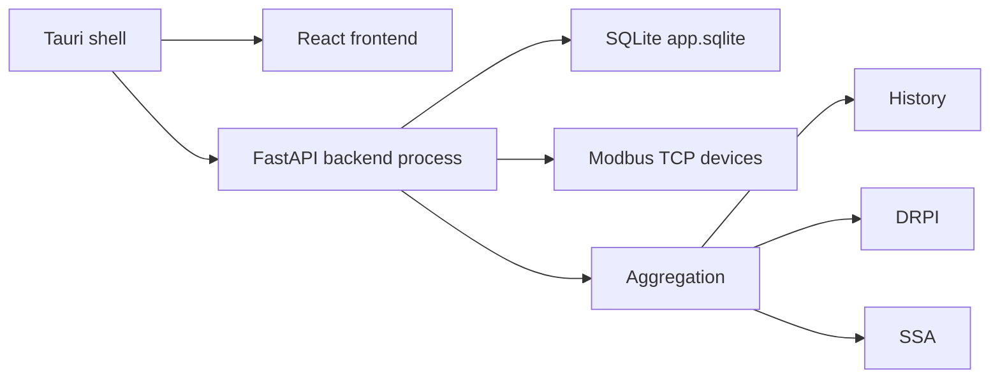

# PowerMeter App Architecture

PowerMeter App is a local-first desktop application for Modbus TCP energy monitoring and analytics.

The v0.2.0 macOS beta combines a Tauri desktop shell, React/Vite frontend, FastAPI backend, SQLite database, Modbus TCP discovery/probing/polling, historical trends, DRPI analytics, and SSA analytics.



## Desktop Runtime

The packaged app stores runtime state under:

```text
~/Library/Application Support/PowerMeter/
```

The backend is bundled into:

```text
PowerMeter.app/Contents/Resources/backend/
```

The executable launched by Tauri is:

```text
PowerMeter.app/Contents/Resources/backend/powermeter-backend
```

Tauri launches the backend with `std::process::Command`, redirects stdout and stderr to app logs, waits for `/api/health`, and terminates only the child process it created when the app exits.

## Backend

The backend exposes authentication, discovery, candidate probing, device management, polling, measurement, aggregation, history, DRPI, SSA, health, and desktop diagnostics APIs.

Desktop mode uses:

```text
POWERMETER_DESKTOP=1
POWERMETER_HOST=127.0.0.1
POWERMETER_PORT=8765
POWERMETER_APP_DATA_DIR=~/Library/Application Support/PowerMeter
POWERMETER_DB_PATH=~/Library/Application Support/PowerMeter/app.sqlite
```

## Frontend

The React/Vite frontend uses `VITE_API_BASE_URL` or `http://127.0.0.1:8000` in browser development mode. In desktop mode it uses `http://127.0.0.1:8765`.

The desktop startup screen checks backend health, fetches desktop diagnostics, and then enters the main app. A diagnostics fetch failure is non-blocking if health is already OK.

## Analytics

The app preserves the existing DRPI and SSA mathematical logic from the research prototype. Desktop packaging and UI work should not alter those formulas.
