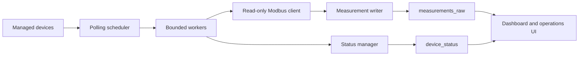

# App Stage 4: Polling Engine and Measurement Pipeline

Stage 4 turns managed Modbus TCP devices into measurement-producing assets. It adds an application polling subsystem without launching the research prototype runtime.

## Architecture

New subsystem:

- `backend/app/polling/scheduler.py`: continuous background scheduler and worker dispatch.
- `backend/app/polling/worker.py`: per-device polling cycle.
- `backend/app/polling/modbus_client.py`: read-only Modbus TCP requests and register decoding.
- `backend/app/polling/measurement_writer.py`: raw measurement inserts.
- `backend/app/polling/status_manager.py`: device status and audit transitions.

## Scheduler Design

The scheduler loads managed devices from the application database, keeps `polling_jobs` synchronized, and dispatches due enabled devices. Concurrency is bounded by `settings.polling_max_parallel_devices`, currently `20`.

Each device has `enabled` and `poll_interval_sec`. Allowed intervals are:

- `10`
- `30`
- `60`
- `300`
- `600`

The default interval is `30` seconds.

## Worker Design

Each worker:

1. loads enabled registers for one device;
2. skips disabled devices;
3. performs only read operations;
4. supports `holding` and `input` registers;
5. decodes `float32`, `float32_swapped`, `uint16`, `int16`, `uint32`, and `int32`;
6. writes successful reads to `measurements_raw`;
7. updates `device_status`.

Failures are isolated per device. A timeout, connection failure, or unexpected exception does not stop the scheduler.

## Status Lifecycle

Device status values:

- `online`: at least one successful read cycle completed.
- `offline`: TCP connection failed.
- `timeout`: Modbus read timed out.
- `error`: unexpected polling or decoding error.
- `disabled`: device is disabled.

## Database Tables

New tables:

- `polling_jobs`
- `measurements_raw`
- `device_status`

The `devices` table now includes `poll_interval_sec`.

## API

Polling control:

- `GET /api/polling/status`
- `POST /api/polling/start`
- `POST /api/polling/stop`

Device status and measurements:

- `GET /api/devices/{device_id}/status`
- `GET /api/devices/{device_id}/measurements?from=&to=&limit=`

Operations endpoints now include polling state and recent app measurements:

- `GET /api/operations/status`
- `GET /api/operations/devices`
- `GET /api/operations/recent-measurements`

## UI

The Devices page shows polling enabled state, interval, current status, and last seen time.

Device Details now shows:

- device status;
- polling configuration;
- recent raw measurements;
- editable polling interval for admin and chief engineer roles.

Operations now includes polling start/stop controls for admin and chief engineer roles.

## Audit Events

Generated events include:

- `polling_started`
- `polling_stopped`
- `polling_failed`
- `device_timeout`
- `device_online`
- `device_offline`

## Limitations

- No aggregation.
- No retention cleanup.
- No DRPI or SSA integration.
- No historical analytics UI.
- No WebSocket streaming.
- No Modbus writes.
- No device configuration writes over Modbus.

## Stage 5 Direction

Stage 5 can build aggregation, historical trend APIs, chart-ready summaries, and analytics preparation on top of `measurements_raw`.
