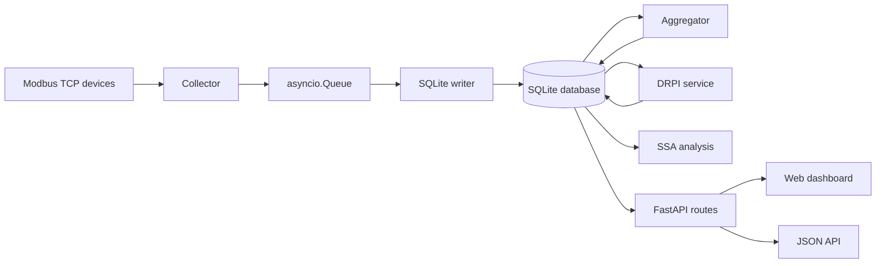

# Architecture

PowerMeter is a local-first data acquisition and analytics system for Modbus TCP power meters. It separates field collection, durable storage, aggregation, analytics, and presentation into small Python modules that can run on a workstation, server, or Raspberry Pi.

## System Components



## Data Flow

1. Device definitions are loaded from `config/devices.yaml`, which is created locally from `config/devices.example.yaml`.
2. `services/collector.py` opens asynchronous Modbus TCP clients, reads configured registers, decodes values, applies scaling, and emits normalized measurement records.
3. Records are passed through an `asyncio.Queue` to avoid coupling field polling directly to database writes.
4. `services/writer.py` validates records, buffers them, and writes batches into SQLite.
5. `services/aggregator.py` reads completed raw-data windows and creates mean-value aggregates for 5, 10, 15, 30, and 60 minutes.
6. `services/drpi_service.py` reads 5-minute active-power aggregates, calculates rolling DRPI for each meter and `TOTAL`, and stores results.
7. `web/app.py` exposes dashboard pages and API routes for overview, history, DRPI, and SSA analysis.
8. `core/ssa_engine.py` is invoked by the SSA API to decompose selected aggregated active-power series on demand.

## Collector

The collector supports:

- Modbus TCP polling through `pymodbus`.
- `holding` and `input` register functions.
- Address modes `minus_400000`, `minus_400001`, and `raw`.
- Data types `float32`, `float32_swapped`, `uint16`, `int16`, `uint32`, and `int32`.
- Per-register scaling.
- Per-device timeouts.
- Parallel polling across devices and sequential register reads within each device.

Normalized collector record:

```json
{
  "timestamp": 1713600000.123,
  "device_id": "PowerMeter_1",
  "metric": "active_power_avg",
  "value": 12.34
}
```

## Writer

The writer is responsible for durable raw-data persistence. It does not read Modbus devices, calculate analytics, or aggregate values.

Main responsibilities:

- Validate required record fields.
- Normalize timestamps, device identifiers, metric names, and values.
- Write records in configurable batches.
- Flush by batch size or time interval.
- Apply SQLite PRAGMA settings such as `WAL`, `NORMAL`, and `MEMORY`.
- Retry failed writes according to `config/writer.yaml`.

## SQLite Storage

Default database path:

```text
data/energy.db
```

Main tables:

- `raw_data`: raw measurements from the collector.
- `agg_5min`: 5-minute mean aggregates.
- `agg_10min`: 10-minute mean aggregates.
- `agg_15min`: 15-minute mean aggregates.
- `agg_30min`: 30-minute mean aggregates.
- `agg_1h`: 60-minute mean aggregates.
- `drpi_results`: rolling DRPI outputs.

The writer creates `raw_data`. The aggregator creates aggregation tables. The DRPI service creates `drpi_results`.

## Aggregator

The aggregator processes only completed windows. This avoids writing partial aggregates while new raw data is still arriving.

Default aggregation windows:

- `300` seconds: `agg_5min`
- `600` seconds: `agg_10min`
- `900` seconds: `agg_15min`
- `1800` seconds: `agg_30min`
- `3600` seconds: `agg_1h`

Default metrics:

- `active_power_avg`
- `voltage_phase_avg`
- `current_avg`
- `frequency`

The default raw-data retention policy keeps raw records for 86,400 seconds, equal to one day. Aggregated data is retained separately.

## Analytics Layer

The analytics layer currently includes:

- `core/drpi_engine.py`: rolling DRPI calculation over active-power series.
- `services/drpi_service.py`: production orchestration for DRPI calculation and result persistence.
- `core/ssa_engine.py`: SSA decomposition, elementary component reconstruction, contribution calculation, W-correlation, and KMeans clustering.
- `web/db.py`: query and response-building helpers for dashboard APIs.

## Web Application

The FastAPI application is defined in `web/app.py`. It mounts static assets, configures templates, redirects `/` to `/overview`, and includes routers for:

- overview dashboard;
- historical data dashboard;
- DRPI dashboard;
- SSA analysis dashboard.

The interactive Swagger/OpenAPI page is available at `/docs`.

## Runtime Topology

PowerMeter normally runs as two processes:

1. Data pipeline:

```bash
python main.py
```

2. Web application:

```bash
uvicorn web.app:app --host 0.0.0.0 --port 8000
```

On Raspberry Pi, the pipeline can be managed through `systemd`; see `docs/RASPBERRY_PI.md`.

## Design Rationale

- SQLite keeps the system easy to deploy and inspect during pilots and field experiments.
- YAML configuration keeps device/register mapping outside the codebase.
- Separate services make data acquisition, persistence, aggregation, and analytics easier to test and evolve.
- FastAPI provides both human-facing dashboards and machine-readable OpenAPI documentation.
- Local-first storage avoids mandatory cloud dependencies for industrial or laboratory networks.
