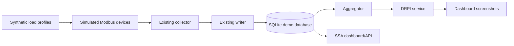

# Demo Mode Plan

PowerMeter does not currently implement a demo mode. This document describes a realistic future demo architecture without adding fake runtime functionality.

## Demo Mode Goals

A good demo mode should let users evaluate the project without physical Modbus meters. It should show the complete experience:

- data acquisition or simulated acquisition;
- SQLite persistence;
- aggregation;
- DRPI calculation;
- SSA analysis;
- dashboards with meaningful data;
- API responses suitable for exploration.

## Proposed Architecture

## Option 1: Simulated Modbus Devices

Create a local Modbus TCP simulator that exposes registers matching `config/devices.example.yaml`.

Recommended behavior:

- expose active power, voltage, current, and frequency;
- use deterministic synthetic profiles;
- support multiple simulated meters;
- include daily cycles, operating shifts, peaks, low-load periods, and noise;
- document expected register addresses and data types.

Benefit:

- exercises the real collector, writer, aggregator, and analytics pipeline.

Tradeoff:

- requires more implementation and maintenance than static fixture data.

## Option 2: Pre-Populated SQLite Database

Provide a small public-safe SQLite database built from synthetic load profiles.

Recommended contents:

- `raw_data` for at least one day;
- aggregate tables for all supported windows;
- `drpi_results` for individual meters and `TOTAL`.

Benefit:

- easiest way to let users open dashboards immediately.

Tradeoff:

- does not exercise Modbus collection.

## Option 3: Synthetic Data Generator

Provide a script that generates deterministic synthetic data and fills SQLite tables.

Recommended profile components:

- base load;
- shift-start and shift-end ramps;
- daily periodicity;
- intermittent equipment cycles;
- short peaks;
- measurement noise;
- multiple meters with different behavior.

Benefit:

- reproducible and transparent.

Tradeoff:

- generated data may not fully represent real industrial load complexity.

## Example Screenshots

After demo data exists, commit screenshots for:

- overview dashboard;
- historical trends;
- DRPI dashboard;
- SSA analysis;
- Swagger/OpenAPI page.

Screenshots should be generated from synthetic or anonymized data only.

## Recommended Implementation Steps

1. Define a synthetic profile schema.
2. Add a deterministic data generator with a fixed random seed.
3. Generate raw active power, current, voltage, and frequency signals.
4. Add a script or documented command to initialize a demo database.
5. Run the existing aggregator and DRPI service against demo data.
6. Add optional Modbus simulator support.
7. Capture screenshots from demo data.
8. Document a one-command demo startup path.

## Success Criteria

Demo mode is ready when a new user can:

- clone the repository;
- install dependencies;
- run one documented command to prepare demo data;
- start the web app;
- open all dashboard pages;
- execute API examples;
- reproduce the same screenshots from synthetic data.
